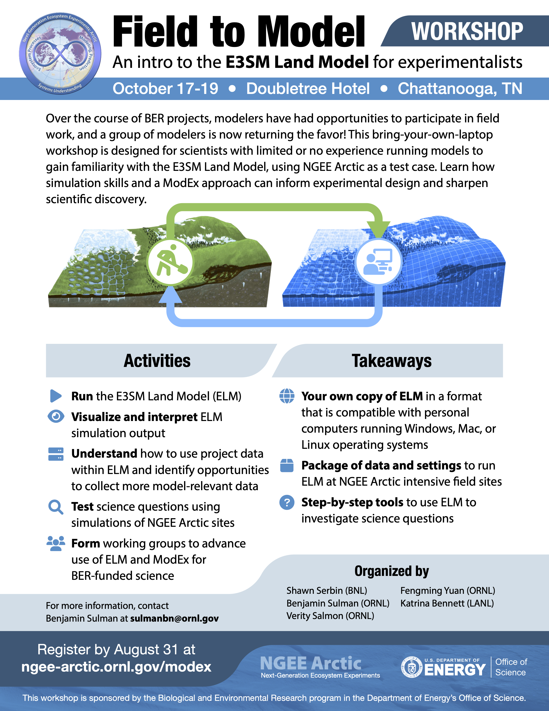

# Dockerized version of the E3SM Land Model (ELM) used during the October, 2022 NGEE-Arctic modeling workshop
 

Workshop Info:
https://ngee-arctic.ornl.gov/highlights/developing-a-land-surface-modeling-workshop-for-ngee-arctic-scientists

Docker hub: https://hub.docker.com/repository/docker/serbinsh/ngeearctic_elm_containers

 

Source code citation:

 

