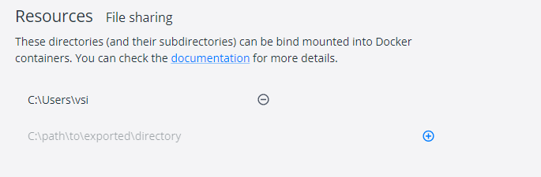
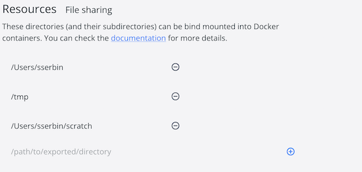
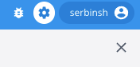
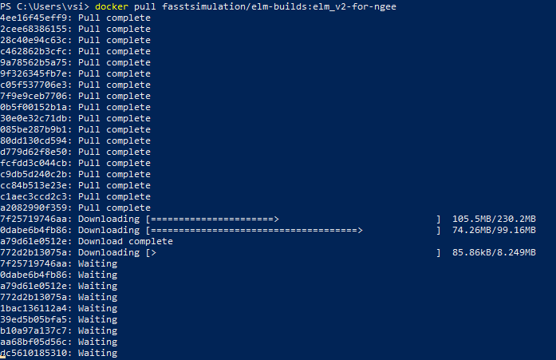
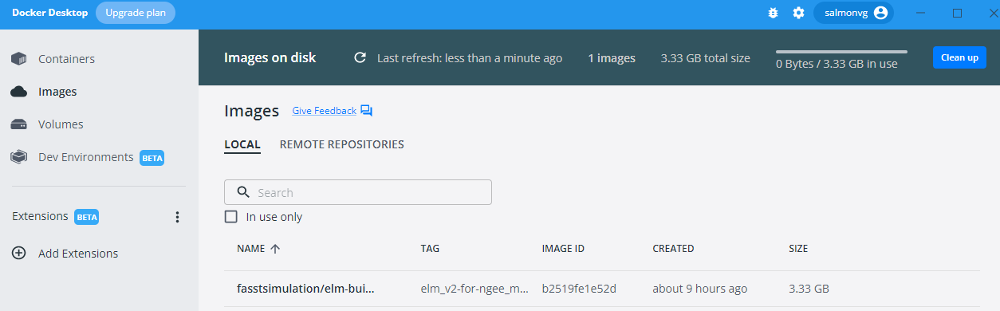
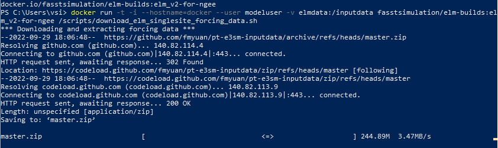
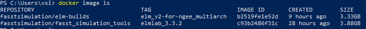

Setting up your Docker desktop
==============================

1. Download the Docker Desktop Application
------------------------------------------
- This download will likely take 2-3 minutes and can be accessed at: https://docs.docker.com/get-docker/
- What is Docker Desktop? Docker Desktop "enables developers to locally build, share, and run containerized applications and microservices. Docker Desktop includes Docker Engine, Docker CLI client, Docker Build/BuildKit, Docker Compose, Docker Content Trust, Kubernetes, Docker Scan, and Credential Helper. Docker Desktop is for Mac and Windows and includes the Docker Dashboard for working with local and remote container images, Dev Environments and more new features are being delivered every month such as Volume Management."
- You can learn more about containers here: https://www.docker.com/resources/what-container/

2. Install Docker Desktop on Your Computer
------------------------------------------
- Open the Docker Desktop Installer that you downloaded. Note that this will require having administrative privileges on your computer.
- Windows users: When prompted, uncheck the box for "Use WSL 2 instead of hyper-V (recommended)"
- There will be a lot of code whizzing by as files are unpacked and the like
- Close the installation box when it is done
- This last step is for Windows users only. You will need to add your computer to the docker-users group. Do this by going to the search bar on your bottom taskbar and search/select "Windows PowerShell." The select this app by right-clicking and choosing "Run as administrator." In the terminal window that opens up, you will type the following code but you need to replace "ornl\vsi" with the appropriate details for your username and computer. The code below currently is for Verity's username (vsi) on her ORNL computer. To check what the structure for your specific PC is, click on the windows button in the bottom right hand corner. Select the gear symbol for settings. In the window that opens, select the "Your info" tab on the left-hand menu. You should see the information as part of your user profile. Don't forget to hit enter after you have put in the modified code in your terminal window!

.. code-block::

   net localgroup docker-users ornl\vsi /ADD

3. Open Docker Desktop and Modify Settings
------------------------------------------
- Open Docker Desktop
- Windows users: you will need to do this by right-clicking on the docker app and selecting "Run as administrator"
- Skip the Docker tutorial.
- Go to Settings by opening the gear symbol in the upper right hand corner of the Docker app
- Select the "Resources" tab on the left-hand menu
- Select "Filesharing" tab on the left-hand menu under "Advanced"
- Select the "+" symbol and add your computer's main drive here so Docker can access and write to your computer.
- Windows users: this will probably look like "C:\Users\username" where "username" is your local username on the computer
- Mac users: this will probably look like "/Users/username" where "username" is your local username on the computer
- All users: If you don't want to share your whole drive, you can also add only specific folders, e.g. "/Users/username/scratch"
- Hit the button "Apply and restart" in the bottom right hand corner of the window
- When you are done, the Resources file sharing table should look like one of the images below:

      Windows users: your username & address should show up instead of vsi

      Mac users: your username & address should show up instead of sserbin

- Note: If a directory containing your user directory is already in the list, there is no need to add the additional directory, and in fact Docker will ignore the new addition. For example, if /Users is in the list, then there is no need to add /Users/username because in that case Docker would have already been given access to directories within /Users.
- Hit the "X" on the top bar across from Settings to go back to the main Docker screen

**Troubleshooting notes**: If Docker Desktop fails to start, you may need to uninstall and reinstall the program. A very common mistake for Windows users to is to forget to run with administrative privileges! This is an easy one to forget and even doing it once will muck things up for future runs. If this happens to you, the easiest thing to do is uninstall and reinstall Docker Desktop.

4. Defining Docker Volumes (2 options)
--------------------------------------
Option 1: Graphically

- In the Docker desktop app, select the "Volumes" tab on the left-hand menu
- Click the "Create (+)" button the upper right-hand corner
- In the popup window, name your volume elmdata and hit "Create"
- Make another volume called elmoutput

Option 2: Command Line

- Open a terminal window on your computer
- Windows users: do this by going to the search bar on your bottom taskbar and search/select "Windows PowerShell"
- Mac users: click the magnifying glass on the right side of the menu bar on top of the screen (to open Spotlight search) and type "Terminal", then open the Terminal program.
- In the terminal window type or copy and paste the following code into your terminal window and hit enter

.. code-block::

   docker volume create elmdata

- In the terminal window type or copy and paste the following code into your terminal window and hit enter

.. code-block::

   docker volume create elmoutput

5. Download ELM Docker Container
--------------------------------
- Open a terminal window on your computer.
  - *Windows* users: do this by going to the search bar on your bottom taskbar, searching and then selecting "Windows PowerShell"
  - *Mac users*: click the magnifying glass on the right side of the menu bar on top of the screen (to open Spotlight search) and type "Terminal", then open the Terminal program
- In the terminal window, type or copy and paste the code below and hit enter:

.. code-block::

   docker pull serbinsh/ngeearctic_elm_containers:elm_v2-for-ngee_multiarch

- The download can take around 10 minutes or more to complete. If it is going well, your terminal window will show progress with a series of arrows that grow from left to right during each file's download:

- When this download is done, you can check that the container made it into your docker app. Select the "Images" tab in the left-hand menu in Docker. There should be an item that has a name "serbinsh/ngeearctic_elm_containers" (NAME column) and "elm_v2-for-ngee_multiarch" (TAG column).

6. Download meteorological data
-------------------------------
- Open a terminal window on your computer the same way you did for the previous steps (using the same window again is fine too if you still have it open)
- Type or copy and paste the following command into your terminal and hit enter:

.. code-block::

   docker run -t -i --hostname=docker --user modeluser -v elmdata:/inputdata serbinsh/ngeearctic_elm_containers:elm_v2-for-ngee_multiarch /scripts/download_elm_singlesite_forcing_data.sh

- If the meteorological data download is working, you should see the download progressing with an arrow bouncing left to right like this:

- When the download is done, you can look in the volumes on your Docker app and see that the elm data folder is now at ~1.2GB

7. Download JupyterLab Docker container for analyzing ELM output
----------------------------------------------------------------

We are going to be using JupyterLab for exploring output from the ELM model runs. JupyterLab is an environment that allows Python code, notebooks, and data to be bundled together. We have set up a specific container on Docker for a JupyterLab that includes code for graphing and analyzing ELM output so that will give folks a few basic tools for data exploration without having to learn Python from scratch. You can learn more about JupyterLab here.

- Open a terminal window on your computer (or use an existing terminal window).
- In the terminal, window type or copy and paste the following code and hit enter:

.. code-block::

   docker pull serbinsh/ngeearctic_elm_containers:elmlab_3.3.2

--------------

After all of these steps, you should have the two primary Docker images on your computer. You can check this in your open terminal by running the following code:

.. code-block::

   docker image ls

You could also check by looking on Docker Desktop and clicking on the "Images" tab on the left-hand menu. Either way, you should see two images listed, one named "elm_v2-for-ngee_multiarch" and named "elmlab_3.3.2":

Remember that image "elm_v2-for-ngee_multiarch" is the tool we will use for actually running ELM while the image "elmlab_3.3.2" is a series of JupyterLab notebooks we will use for looking at output from the ELM runs.

CONGRATULATIONS
---------------

**You are ready for the NGEE Arctic Modex workshop!**

